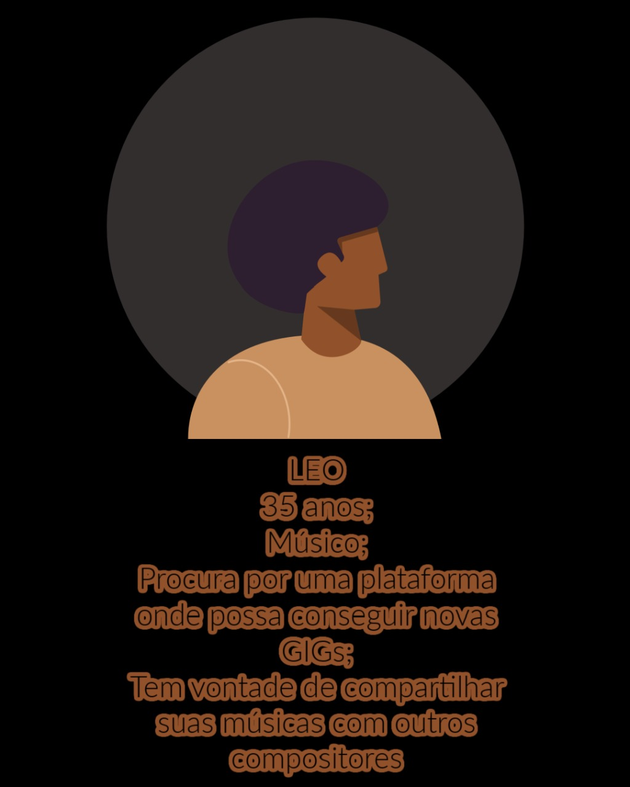

# Criando uma Rede Social

## Índice

- [1. Prefácio](#1-prefácio)
- [2. Definição do Produto e Resumo do Projeto](#2-definição-do-produto-e-resumo-do-projeto)
- [3. Nosso Público](#3-nosso-público)
- [4. A Interface do Projeto](#4-a-interface-do-projeto)

- [5.Implementação Futura](#5-implementação-do-futura)
---

## 1. Prefácio

Instagram, Snapchat, Twitter, Facebook, Twitch, Linkedin, etc. As redes sociais invadiram nossas vidas.

 Nós as amamos ou odiamos e muitas pessoas não conseguem viver sem elas.
Há redes sociais de todo tipo para todos os tipos de interesse. Por exemplo: em uma rodada de financiamento com investidores, foi apresentada uma rede social para químicos onde os usuários podem publicar artigos a respeito de suas pesquisas, comentar os artigos de seus colegas e filtrar artigos de acordo com determinadas tags ou popularidade, mais recente ou mais comentado.

## 2. Definição do Produto e Resumo do Projeto

Black Talents, é uma rede social que conecta pessoas artistas pretas à outras artistas pretas e que possibilita uma troca de vivências entre elas e a divulgação e expansão de seus trabalhos (dos mais variados segmentos artísticos) à compradores, curadores, colecionadores e público em geral. 
As personas listadas abaixo e necessidades do usuário foram posteriormente validadas através de entrevistas com artistas pretas atuantes no mercado brasileiro.

*Persona 1
 

*Persona 2

## 3. Nosso Público

Pessoas artistas pretas que sentem a necessidade de uma plataforma própria para interagir entre si, se descobrirem e se conectarem. Sejam eles na área da música, da dança, pintura, escultura, teatro, literatura, cinema ou performance.

Vendo essa necessidade, nós fizemos o que ???

CRIAMOS UM ESPAÇO PRA SUPRIR ESTA NECESSIDADE !!

## 4. A Interface do Projeto

###  Protótipo de interface do usuário 

Na imagem abaixo é o  escopo do projeto, inclusive algumas mudanças ocorreram, para que melhor atendesse a necessidade dos usuários. 

### Tela de Login

Aqui a usuária poderá ter acesso a aplicação com o email e senha ou se preferir com uma conta do Google e caso não tenha uma conta, realizar seu cadastro através do link “Cadastre-se”.

Nesta tela, a usuária poderá efetuar um cadastro simples, basta inserir um email e senha válido e clicar no botão "Criar".

Após efetuar o login, a artista terá acesso a tela de feed, na qual ela poderá criar as suas postagens, curtir outras publicações, editar o próprio post e também excluir somente as suas publicações. (Procurar por outras pessoas por localidade (??))

## 5. Implementação Futura

 

 Os usuários poderão se conectar também por proximidade na localização.
